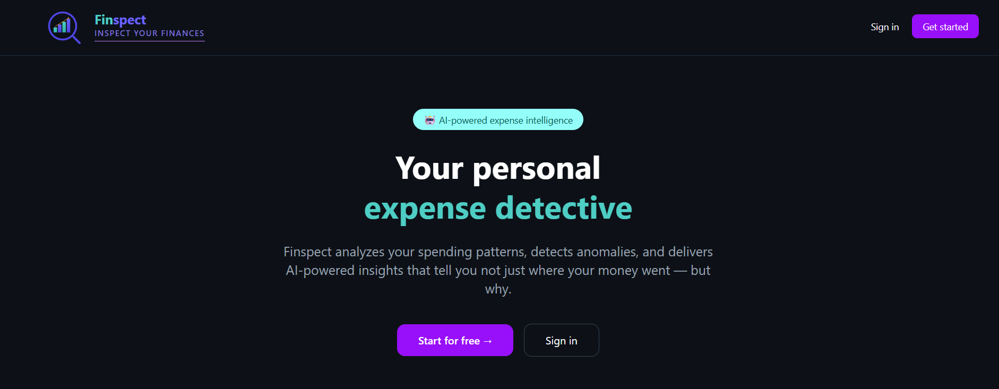
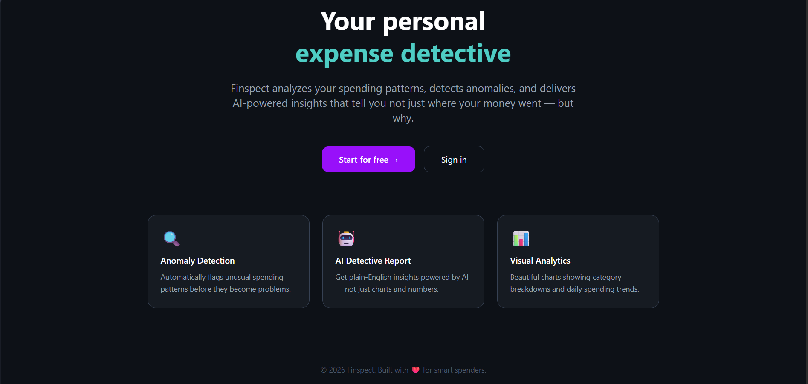
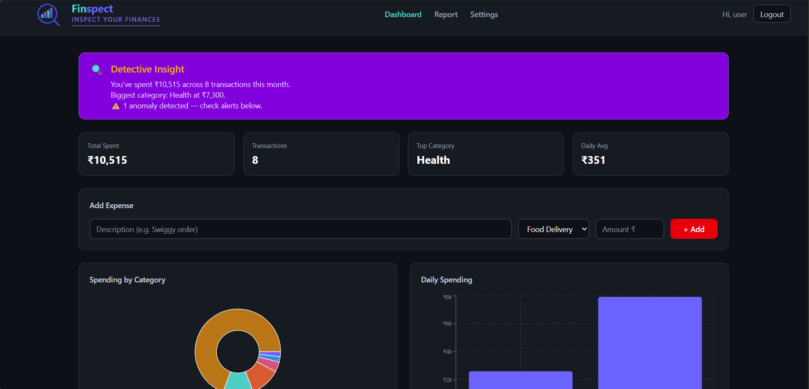
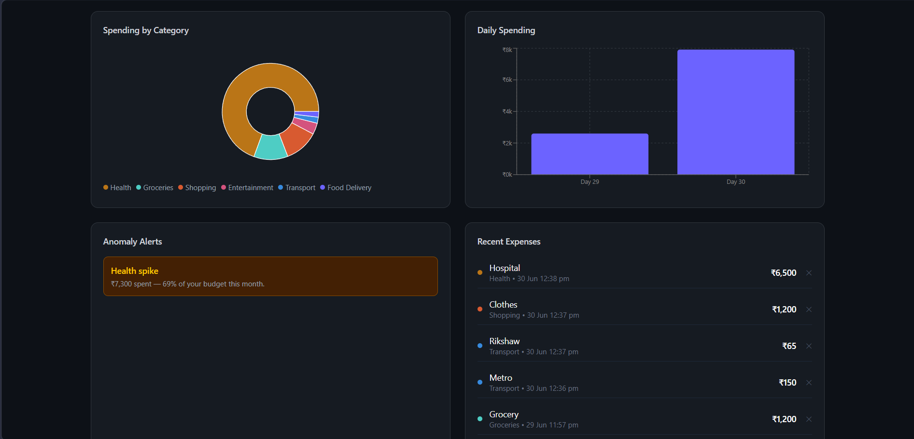
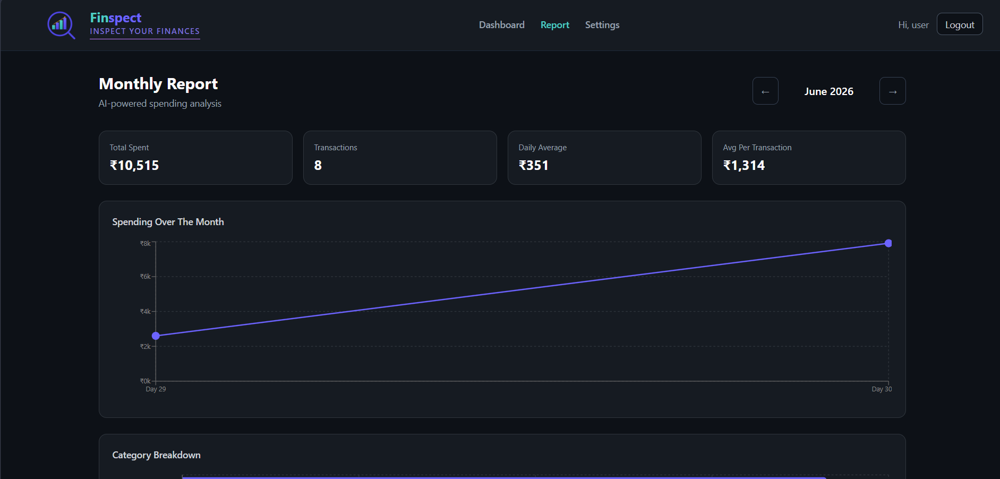
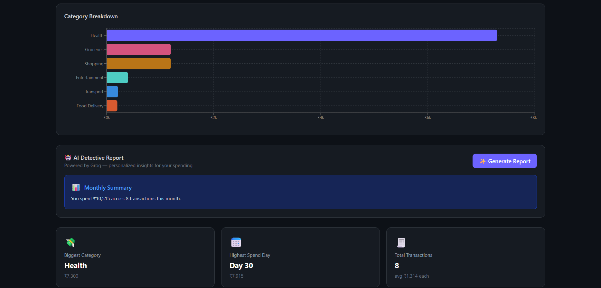
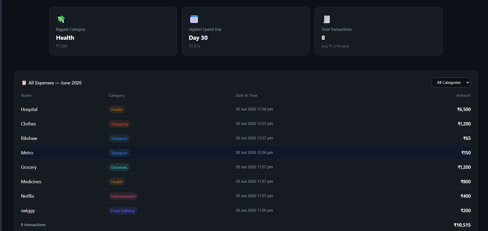
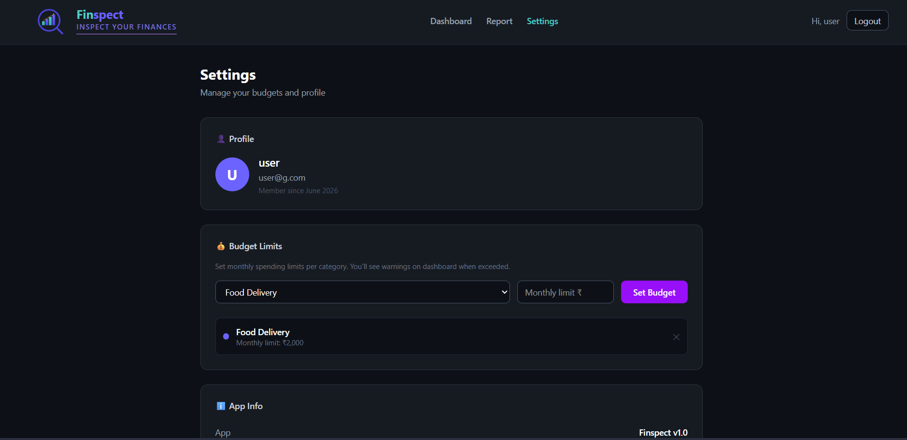
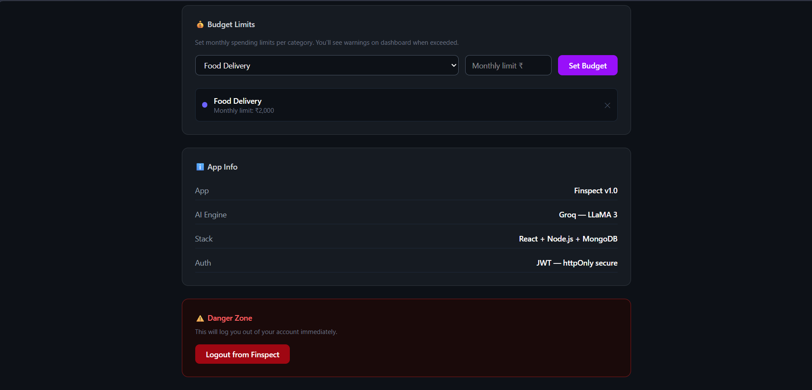

# 🔍 Finspect — AI Expense Detective

> Inspect your finances. Detect anomalies. Get AI-powered insights.

**Live Demo:** [finspect.vercel.app](https://finspect-jet.vercel.app)

**Demo Credentials** (for quick testing — pre-loaded with sample data):
Email: user@g.com
Password: 111222

---

## 📁 Project Structure

```
finspect/
  backend/        → Express API, MongoDB models, JWT auth, AI logic
  frontend/       → React app, Tailwind UI, Recharts dashboards
  screenshots/    → README images
```

## 📸 Screenshots

### Landing Page
<table>
  <tr>
    <td></td>
    <td></td>
  </tr>
</table>

### Dashboard
<table>
  <tr>
    <td></td>
    <td></td>
  </tr>
</table>

### Monthly Report
<table>
  <tr>
    <td></td>
    <td></td>
    <td></td>
  </tr>
</table>

### Settings
<table>
  <tr>
    <td></td>
    <td></td>
  </tr>
</table>

---

## 🚀 Tech Stack

**Frontend**
- React + Vite
- Tailwind CSS
- Recharts
- Zustand
- React Router
- Axios

**Backend**
- Node.js + Express
- MongoDB + Mongoose
- JWT Authentication
- bcrypt
- Zod Validation
- Groq AI (LLaMA 3)

---

## ✨ Features

- JWT authentication — secure register and login
- Add, view, and delete expenses across categories
- Pie chart — category-wise spending breakdown
- Bar chart and line chart — daily and monthly spending trends
- Automatic anomaly detection — flags unusual spending patterns
- Budget limits per category with visual progress alerts
- AI Detective Report — personalized insights generated via Groq LLaMA 3
- Monthly report page with month switcher
- Full expense history table with category filter
- Fully responsive — mobile, tablet, and desktop

---

## 🧠 Architecture Decisions

**Authentication**
JWT issued on login/register, stored client-side, attached to every request via an Axios interceptor. Protected routes use middleware that verifies the token before reaching any controller.

**State Management**
Zustand instead of Redux — a single store file with no reducers or actions, ideal for a project of this scope while still demonstrating real state management outside React's local state.

**Validation**
Zod schemas validate incoming request bodies on the backend, catching malformed data before it touches the database.

**Anomaly Detection**
A pure utility function evaluates three conditions on every summary request:
- Any category exceeding 40% of total monthly spend
- Any single day exceeding 2x the daily average
- The last 3 transactions trending 40%+ above the overall average

Each match returns a structured alert object consumed directly by the frontend.

**AI Insights**
The monthly summary (category totals, daily totals, transaction count) is sent to Groq's LLaMA 3 model with a structured prompt requesting a JSON array of insights. The response is parsed and rendered as detective-style insight cards. A local fallback insight is returned if the API call fails, so the feature degrades gracefully rather than breaking.

---

## 🚀 Deployment

**Backend — Render**
- Connected GitHub repo to Render
- Root directory: `backend`
- Runtime: Node.js
- Build command: `npm install`
- Start command: `node server.js`
- Environment variables configured: `MONGO_URI`, `JWT_SECRET`, `GROQ_API_KEY`, `CLIENT_URL`, `PORT`
- Database hosted on MongoDB Atlas (free tier cluster)

**Frontend — Vercel**
- Connected same GitHub repo to Vercel
- Root directory: `frontend`
- Framework preset: Vite
- Build command: `npm run build`
- Output directory: `dist`
- Environment variable: `VITE_API_URL` pointing to the deployed Render backend

**CORS Configuration**
Backend's CORS origin is set dynamically via `CLIENT_URL` environment variable to allow only the deployed frontend domain, while still supporting `localhost:5173` for local development.

**CI/CD**
Both Render and Vercel point to the same GitHub repo but use different root directories (`backend` and `frontend`), so every `git push` to `main` triggers independent redeployments of each service.

---

## ⚙️ Local Setup

Clone the repo:
```bash
git clone https://github.com/yourusername/finspect.git
cd finspect
```

**Backend**
```bash
cd backend
npm install
```

Create a `.env` file:
```
MONGO_URI=your_mongodb_connection_string
JWT_SECRET=your_secret_key
GROQ_API_KEY=your_groq_api_key
PORT=5000
```

```bash
npm run dev
```

**Frontend** (in a new terminal, from root)
```bash
cd frontend
npm install
```

Create a `.env` file:
```
VITE_API_URL=http://localhost:5000/api
```

```bash
npm run dev
```

---

## 📡 API Endpoints

| Method | Endpoint | Description |
|--------|----------|-------------|
| POST | `/api/auth/register` | Register a new user |
| POST | `/api/auth/login` | Login and receive JWT |
| GET | `/api/auth/me` | Get current authenticated user |
| GET | `/api/expenses` | Get expenses (supports month/year query) |
| POST | `/api/expenses` | Create a new expense |
| PUT | `/api/expenses/:id` | Update an expense |
| DELETE | `/api/expenses/:id` | Delete an expense |
| GET | `/api/expenses/summary` | Get monthly category/daily totals + anomalies |
| GET | `/api/expenses/ai-report` | Get AI-generated insights for the month |
| GET | `/api/budgets` | Get all budget limits |
| POST | `/api/budgets` | Create or update a budget limit |
| DELETE | `/api/budgets/:id` | Delete a budget limit |

---

## 👨‍💻 Author

**Ayush** — [GitHub](https://github.com/ayush-git121)

---

## 📄 License

This project is open source and available for learning purposes.